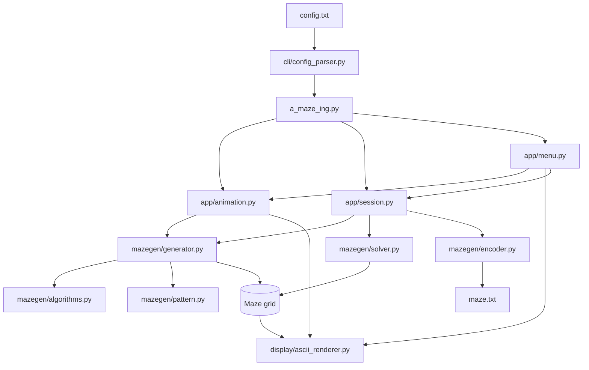

*This project has been created as part of the 42 curriculum by adedias-, mirelsan.*

# A-Maze-ing

## Description

A-Maze-ing is a terminal-based maze generator, solver and visualizer created for
the 42 curriculum. It generates a maze from a text configuration file, displays
the construction process as an animation, finds the shortest path from the
entry to the exit, and saves an encoded representation of the result.

The project also includes the `42` pattern when the maze is large enough, ANSI
colours, configurable random seeds, maze regeneration, and an interactive
menu. The default output is an ASCII maze that can be viewed in a terminal.

## Features

- Configurable maze width, height, entry, exit, output file and random seed.
- Perfect mazes (a spanning tree) or mazes with extra loops and fewer dead ends.
- Four generation algorithms: depth-first search, randomized Prim, randomized
  Kruskal and Wilson's algorithm.
- Breadth-first search solver that displays the shortest path.
- Animated generation and path tracing.
- Interactive menu to regenerate a maze, show or hide the path, rotate wall
  colours, and quit.
- Optional `42` pattern in the centre of sufficiently large mazes.

## Architecture

The main execution path is represented below from the configuration file to
the generated maze and the interactive terminal menu:



## Instructions

The project requires Python 3.13 or newer and has no runtime dependencies.

From the repository root:

```bash
cd amazing
python3 -m venv .venv
. .venv/bin/activate
make install
make run
```

`make install` installs the development tools used by the project (`flake8`,
`mypy` and `build`). To run without installing those tools:

```bash
cd amazing
python3 a_maze_ing.py config.txt
```

Useful Make targets are:

```text
make run          Generate, solve and display the maze from config.txt
make debug        Run the program with pdb
make lint         Run flake8 and mypy checks
make lint-strict  Run strict mypy checks
make build        Build the Python package
make clean        Remove caches and build artefacts
```

The program expects exactly one configuration path:

```bash
python3 a_maze_ing.py path/to/config.txt
```

### Configuration file

The file uses one `KEY=VALUE` entry per line. Blank lines and lines beginning
with `#` are ignored. Keys must not be repeated. The complete format is:

```text
WIDTH=20
HEIGHT=15
ENTRY=0,0
EXIT=19,14
OUTPUT_FILE=maze.txt
PERFECT=True
SEED=42
ALGORITHM=dfs
```

Required keys are `WIDTH`, `HEIGHT`, `ENTRY`, `EXIT`, `OUTPUT_FILE` and
`PERFECT`. `SEED` and `ALGORITHM` are optional. If `SEED` is omitted, the
generator uses non-deterministic randomness. If `ALGORITHM` is omitted, the
default is `dfs`.

- `WIDTH` and `HEIGHT`: positive integers.
- `ENTRY` and `EXIT`: coordinates in `x,y` format, inside the maze, and
  different from each other.
- `OUTPUT_FILE`: path of the generated encoded maze file.
- `PERFECT`: `True` creates a perfect maze; `False` removes some dead ends and
  adds extra loops.
- `SEED`: optional integer used to reproduce a maze.
- `ALGORITHM`: `dfs`, `prim`, `kruskal` or `wilson`.

The output file contains one hexadecimal wall value per cell, followed by a
blank line, the entry coordinate, the exit coordinate and the solution path.
Wall bits are `N=1`, `E=2`, `S=4` and `W=8`; a set bit means that wall is
closed.

### Example

To use another algorithm, copy `config.txt`, change the algorithm and run it:

```bash
cp config.txt config-prim.txt
sed -i 's/ALGORITHM=dfs/ALGORITHM=prim/' config-prim.txt
python3 a_maze_ing.py config-prim.txt
```

## Algorithm

The project's default and primary chosen algorithm is randomized depth-first
search (DFS), implemented as an iterative backtracker. It starts at the entry,
chooses an unvisited neighbouring cell at random, opens the wall between the
cells, and backtracks when there are no unvisited neighbours left. This
produces a spanning tree, so every cell is reachable and a perfect maze has a
unique path between any two cells.

DFS was chosen because it is straightforward to understand and test, uses
little additional memory, naturally supports step-by-step animation, and
creates long corridors that make the generated mazes visually clear in a
terminal. The seeded `random.Random` instance also makes runs reproducible.

For advanced use, the same generation interface supports randomized Prim,
randomized Kruskal and Wilson's loop-erased random walk. They all produce a
connected spanning tree before the optional non-perfect post-processing.

## Reusable code

The maze engine is separated from the command-line interface, so it can be
reused independently. `MazeGenerator` can generate mazes step by step or in a
single call; `MazeSolver` solves any compatible grid; `render_maze` renders a
grid as text; and the encoder writes a stable file representation. The
algorithm functions expose a common iterator-based edge interface, which makes
it possible to add another generator without changing the renderer, solver or
menu. Configuration parsing and validation are also isolated in `cli`.

## Team and project management

### Team roles

- **adedias-**: solving and encoding logic, terminal
  interaction, command-line flow and maze generation algorithms.
- **mirelsan**: project integration, project planning workflow approach, tests, 
technical documentation, packaging and final delivery.

Both members reviewed the behaviour together and contributed to integration
and debugging as needed.

### Planning and retrospective

The initial plan was to establish the repository and branch workflow, parse a
minimal configuration, implement maze generation and solving, add the ASCII
renderer, and finish with validation and bonus features. During development,
the scope evolved to include animated generation, the `42` pattern, multiple
generation algorithms, non-perfect mazes, seeded reproducibility, an
interactive menu and coloured output.

The modular separation between generation, solving, rendering and file output
worked well: each part could be tested and extended without rewriting the
whole application. The main improvements for a future iteration would be to
add broader automated tests for the interactive animation and every algorithm,
improve terminal portability, and make the team planning and task tracking
more explicit from the start.

Tools used included Git and GitHub for version control and collaboration,
Python 3.13, `make`, `flake8`, `mypy`, `pdb`, and the standard library modules
`random`, `collections` and `dataclasses`.

## Resources

- [Python documentation](https://docs.python.org/3/), especially `random`,
  `collections.deque` and `dataclasses`.
- [Depth-first search - Wikipedia](https://en.wikipedia.org/wiki/Depth-first_search).
- [Maze generation algorithm - Wikipedia](https://en.wikipedia.org/wiki/Maze_generation_algorithm).
- [Maze solving algorithm - Wikipedia](https://en.wikipedia.org/wiki/Maze-solving_algorithm).
- [Wilson's algorithm](https://en.wikipedia.org/wiki/Loop-erased_random_walk).
- 42 subject requirements and the project evaluation checklist.

### Use of AI

AI was used as a development assistant for reviewing the project structure,
checking implementation details against the 42 requirements, suggesting
README organization and wording, and identifying documentation gaps. AI did
not replace the team's design decisions or testing: the maze algorithms,
configuration format, terminal workflow and project integration were reviewed
and validated by the team.