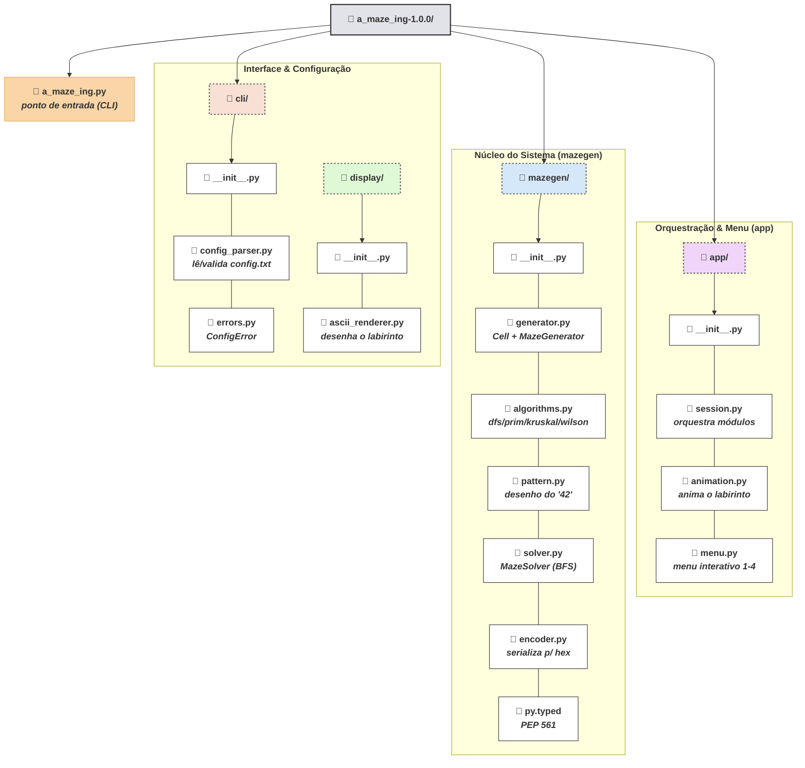
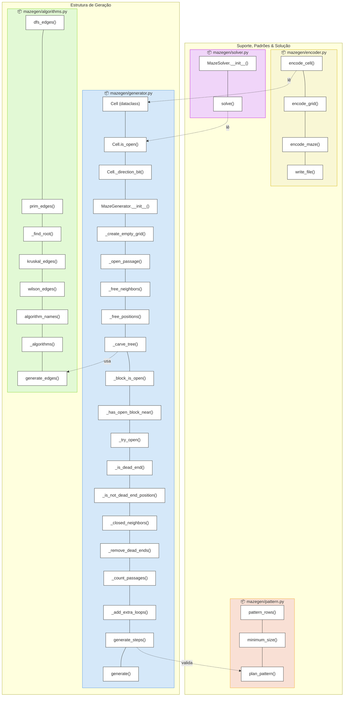
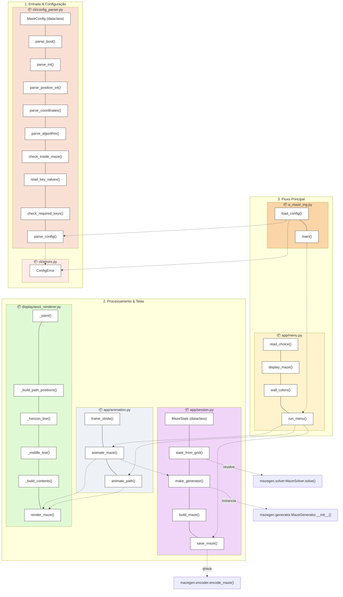

# Diagramas — A-Maze-ing

## Diagrama 1 — Estrutura de arquivos e pastas (só código)

*(Sem `tests/`, `README.md`, `LICENSE.md`, `pyproject.toml`, `Makefile`, `config.txt` — só a parte de código.)*

---

## Diagrama 2 — Funções por arquivo e suas referências

### 2a. Núcleo — `mazegen/`

### 2b. Camada de aplicação — `cli/`, `display/`, `app/`, `a_maze_ing.py`

